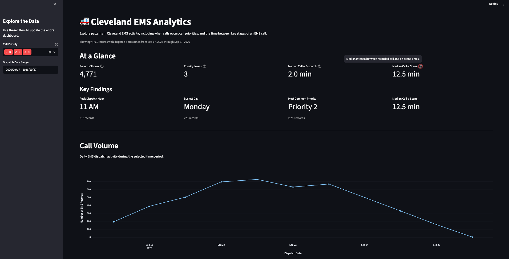

# 🚑 Cleveland EMS Analytics

An end-to-end Python and SQL analytics project exploring patterns in public Cleveland EMS call data through an interactive Streamlit dashboard.



## Overview

This project analyzes real-world Cleveland EMS data to explore when EMS activity occurs, how call priorities are distributed, and the time between key stages of an EMS call.

I built the project as a way to connect my previous EMS experience with the Python, SQL, and data skills I am developing in computer science.

The dashboard allows users to explore:

- EMS dispatch volume over time
- Activity by hour of day
- Activity by day of week
- Call priority distribution
- Call-to-dispatch intervals
- Call-to-scene intervals
- Missing and unusual data
- Automatically generated key findings

## How It Works

The project follows an end-to-end data pipeline:

```text
Cleveland EMS API
        ↓
Python requests
        ↓
pandas cleaning and transformation
        ↓
CSV
        ↓
SQLite
        ↓
SQL analysis
        ↓
Streamlit + Plotly dashboard
```

Python retrieves recent EMS records from a public API. The API response is converted into a pandas DataFrame, timestamps are cleaned and converted to local time, and additional analytical fields are created.

The processed data is then stored in SQLite and used by the Streamlit dashboard to generate interactive metrics and visualizations.

## Dashboard

The dashboard includes:

- Interactive date and call-priority filters
- Summary metrics
- Automatically generated key findings
- Daily dispatch-volume trends
- Dispatch activity by hour
- Dispatch activity by day of week
- Priority-code percentages
- Call-to-dispatch timing distributions
- Call-to-scene timing distributions
- Data-quality information
- Sample records

The current dashboard analyzes several thousand recent EMS records while preserving incomplete records for analyses where their available fields are still useful.

## Technologies

- **Python**
- **pandas**
- **requests**
- **SQL**
- **SQLite**
- **Streamlit**
- **Plotly**
- **Git / GitHub**

## Project Structure

```text
cleveland-ems-analytics/
├── app.py
├── requirements.txt
├── README.md
├── assets/
│   └── dashboard.png
├── data/
├── sql/
│   └── analysis.sql
└── src/
    ├── load_data.py
    └── build_database.py
```

Generated CSV and SQLite database files are excluded from GitHub and can be recreated by running the data pipeline.

## Running the Project

### 1. Create a virtual environment

```bash
python3 -m venv .venv
source .venv/bin/activate
```

### 2. Install dependencies

```bash
pip install -r requirements.txt
```

### 3. Download and process the EMS data

```bash
python src/load_data.py
```

### 4. Build the SQLite database

```bash
python src/build_database.py
```

### 5. Launch the dashboard

```bash
streamlit run app.py
```

The dashboard will open locally in the browser.

## Data Quality

Real-world operational data is not always complete.

Some records contain missing timestamps or unusual timing values. Instead of automatically deleting incomplete records, the project preserves them and only requires the necessary fields for each specific analysis.

For example, a record without an on-scene timestamp may still be useful when analyzing dispatch volume or call priority.

Timing visualizations are limited to the 99th percentile for readability while the underlying records remain unchanged.

## Interpreting the Timing Metrics

The project calculates intervals including:

- **Call → Dispatch**
- **Call → On Scene**

These values are derived from timestamps available in the public dataset and should be interpreted as **call-to-event intervals**, not official Cleveland EMS response-time or performance metrics.

## Privacy

The project focuses on aggregate operational patterns.

Incident-level location fields and personally identifying information are not included in the dashboard.

## What I Learned

This project gave me hands-on experience with:

- Retrieving data from a public API
- Working with JSON responses
- Cleaning real-world data with pandas
- Handling missing values
- Working with timestamps and time zones
- Creating new analytical features
- Building and querying a SQLite database
- Writing SQL analysis queries
- Creating interactive visualizations
- Designing a dashboard around what a user actually needs to understand
- Working with imperfect operational data instead of a pre-cleaned practice dataset

## Future Improvements

Possible next steps include:

- Analyzing a longer historical period
- Automating data refreshes
- Expanding the SQL analysis
- Adding appropriately aggregated geographic analysis
- Deploying the dashboard publicly